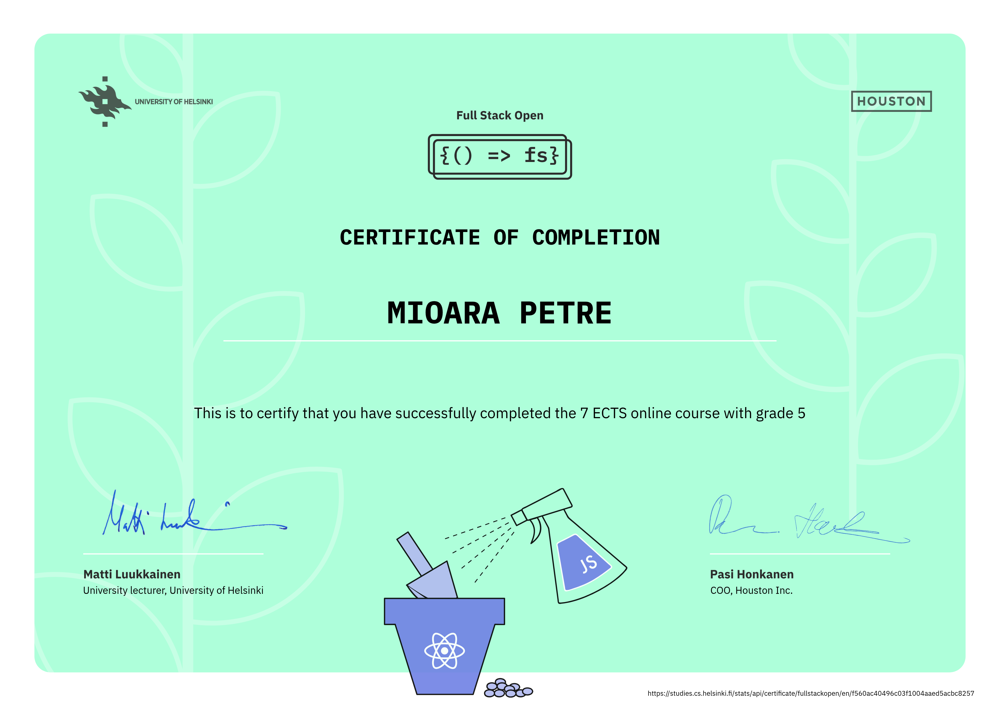
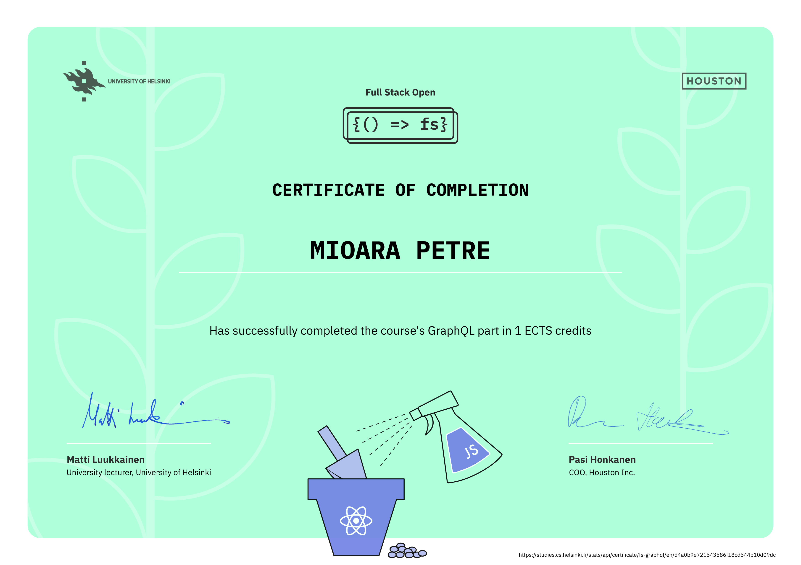
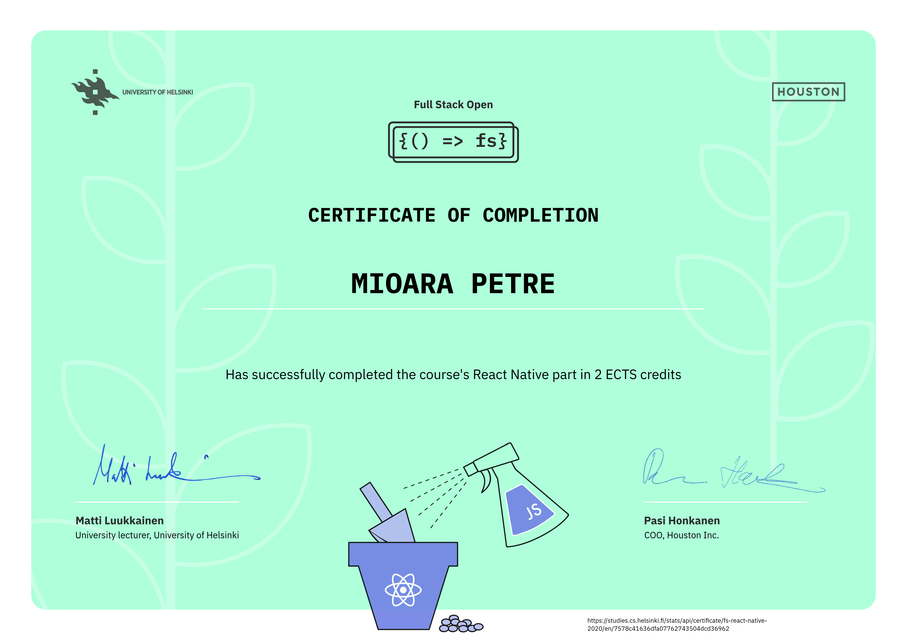

# Full-Stack Open: Deep Dive Into Modern Web Development

This repository contains my solutions for the exercises from the [University of Helsinki](https://www.helsinki.fi/)'s [Full Stack open](https://fullstackopen.com/en/) course. Throughout this course, you'll deep dive into key modern web development technologies like **React**, **Redux**, **Node.js**, **MongoDB**, **GraphQL**, **TypeScript**, and **React Native** with a primary focus on building **single-page applications (SPAs)** that interact with **REST APIs** built with **Node.js**.

## Course Content

### Part 0 – Fundamentals of Web Apps
In this part, we will familiarize ourselves with the course structure and goals. We'll also dive into the basics of web development and explore the evolution of web applications over the last few decades. Key topics include web application architecture, the **HTTP protocol**, developer tools, traditional web apps, **AJAX**, **single-page applications**, and **JavaScript** libraries.

### Part 1 – Introduction to React
This section introduces the **React** library, which we'll use to build dynamic client-side applications. We will also review key **JavaScript** concepts necessary for understanding React, laying the groundwork for more advanced topics.

### Part 2 – Communicating with the Server
Here, we’ll continue our **React** journey by learning how to render dynamic data – like a list of names – on the screen. We'll also cover how to handle user input via HTML forms, fetch data from a remote **backend** server using **JavaScript**, and apply basic **CSS** styling to our **React** apps.

### Part 3 – Programming a Server with Node.js and Express
This part shifts focus to the **backend**, where we will create a simple **REST API** using **Node.js** and the **Express** framework. The application’s data will be stored in a **MongoDB** database. By the end of this section, we’ll deploy the API to the web.

### Part 4 – Testing Express Servers and User Administration
We’ll continue working on the **backend** by focusing on writing **unit** and **integration tests** for server-side code. Additionally, we will learn to implement **user authentication** and **authorization**, enabling secure access to our application.

### Part 5 – Testing React Apps
Returning to the frontend, we’ll explore testing strategies for **React** applications. We’ll also implement **token-based authentication**, enabling users to securely log in and interact with our app.

### Part 6 – Advanced State Management
As applications grow in complexity, managing state inside **React** components becomes challenging. In this part, we’ll introduce **Redux**, a popular solution for centralized state management in React apps. We’ll also explore alternatives like **React's Context API**, the **useReducer** hook, and **React Query** for managing server-side state.

### Part 7 – React Router, Custom Hooks, and Advanced Styling
In this section, we’ll learn how to use **React Router** to manage multiple views in a **single-page app** based on the URL in the browser’s address bar. We’ll also cover **custom hooks**, explore advanced styling techniques for **React apps**, and dive into configuring the build toolchain using **Webpack**, an alternative to the default **Vite** setup used throughout the course.

### Part 8 – GraphQL
In this part, we’ll learn about **GraphQL**, an alternative to **REST** for client-server communication. GraphQL allows clients to request exactly the data they need, reducing over-fetching and improving API performance. We’ll explore how to set up a **GraphQL server**, integrate it with a **React app**, and use advanced features like **fragments**, **subscriptions**, and **cache management** for more efficient data handling.

### Part 9 – TypeScript
In this section, we dive into **TypeScript**, a statically-typed superset of **JavaScript**. TypeScript improves code quality by adding static types, which catch errors during compile-time and enhance maintainability. We’ll apply TypeScript to both **backend (Node.js)** and **frontend (React)** projects, including integrating **Express** with **TypeScript** and enhancing **React** components with types.

### Part 10 – React Native
In this part, we’ll learn how to build native mobile apps for **Android** and **iOS** using **React Native**. We’ll cover the basics of rendering native **UI components**, handling user input, and communicating with a **backend**. Additionally, we’ll explore **testing** and **extending** our app, ensuring that it’s robust and mobile-friendly.

## Course Certificates

