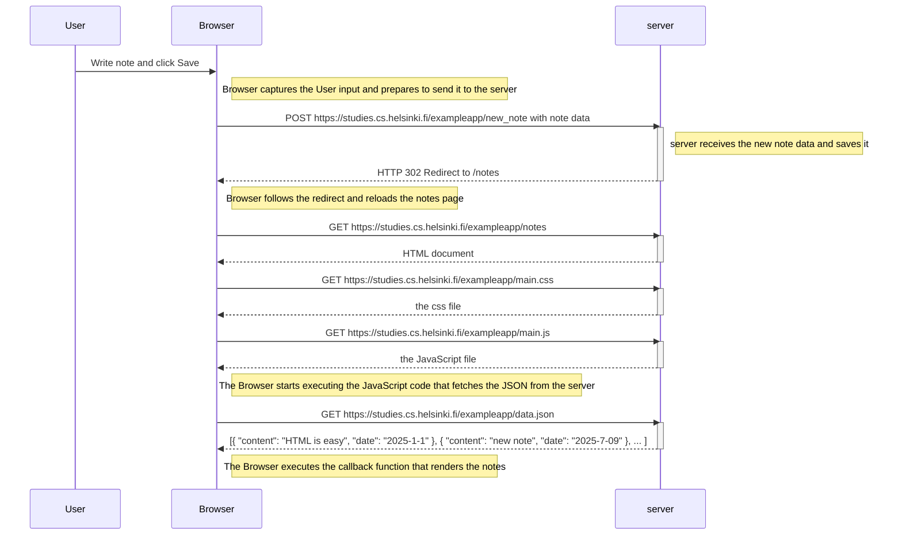
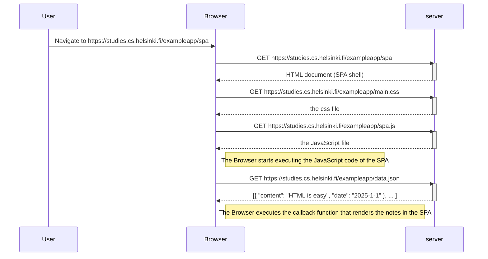
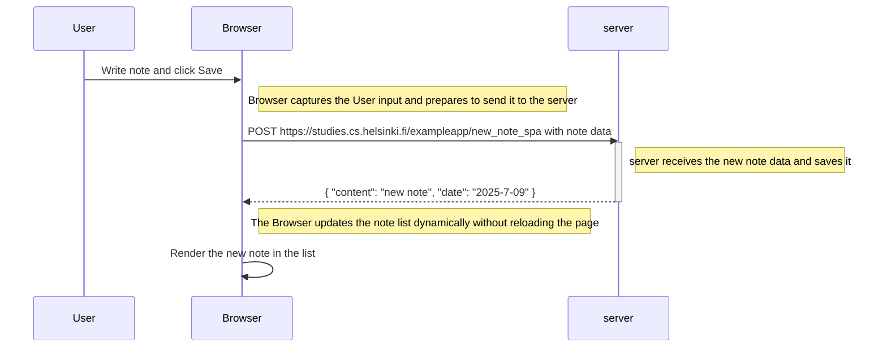

```mermaid
sequenceDiagram
    participant User
    participant Browser
    participant server

    User->>Browser: Write note and click Save
    Note right of Browser: Browser captures the User input and prepares to send it to the server

    Browser->>server: POST https://studies.cs.helsinki.fi/exampleapp/new_note with note data
    activate server
    Note right of server: server receives the new note data and saves it
    server-->>Browser: HTTP 302 Redirect to /notes
    deactivate server

    Note right of Browser: Browser follows the redirect and reloads the notes page

    Browser->>server: GET https://studies.cs.helsinki.fi/exampleapp/notes
    activate server
    server-->>Browser: HTML document
    deactivate server

    Browser->>server: GET https://studies.cs.helsinki.fi/exampleapp/main.css
    activate server
    server-->>Browser: the css file
    deactivate server

    Browser->>server: GET https://studies.cs.helsinki.fi/exampleapp/main.js
    activate server
    server-->>Browser: the JavaScript file
    deactivate server

    Note right of Browser: The Browser starts executing the JavaScript code that fetches the JSON from the server

    Browser->>server: GET https://studies.cs.helsinki.fi/exampleapp/data.json
    activate server
    server-->>Browser: [{ "content": "HTML is easy", "date": "2025-1-1" }, { "content": "new note", "date": "2025-7-09" }, ... ]
    deactivate server

    Note right of Browser: The Browser executes the callback function that renders the notes


```

```mermaid
sequenceDiagram
    participant User
    participant Browser
    participant server

    User->>Browser: Navigate to https://studies.cs.helsinki.fi/exampleapp/spa
    Browser->>server: GET https://studies.cs.helsinki.fi/exampleapp/spa
    activate server
    server-->>Browser: HTML document (SPA shell)
    deactivate server

    Browser->>server: GET https://studies.cs.helsinki.fi/exampleapp/main.css
    activate server
    server-->>Browser: the css file
    deactivate server

    Browser->>server: GET https://studies.cs.helsinki.fi/exampleapp/spa.js
    activate server
    server-->>Browser: the JavaScript file
    deactivate server

    Note right of Browser: The Browser starts executing the JavaScript code of the SPA

    Browser->>server: GET https://studies.cs.helsinki.fi/exampleapp/data.json
    activate server
    server-->>Browser: [{ "content": "HTML is easy", "date": "2025-1-1" }, ... ]
    deactivate server

    Note right of Browser: The Browser executes the callback function that renders the notes in the SPA

```

```mermaid
sequenceDiagram
    participant User
    participant Browser
    participant server

    User->>Browser: Write note and click Save
    Note right of Browser: Browser captures the User input and prepares to send it to the server

    Browser->>server: POST https://studies.cs.helsinki.fi/exampleapp/new_note_spa with note data
    activate server
    Note right of server: server receives the new note data and saves it
    server-->>Browser: { "content": "new note", "date": "2025-7-09" }
    deactivate server

    Note right of Browser: The Browser updates the note list dynamically without reloading the page
    Browser->>Browser: Render the new note in the list

```
